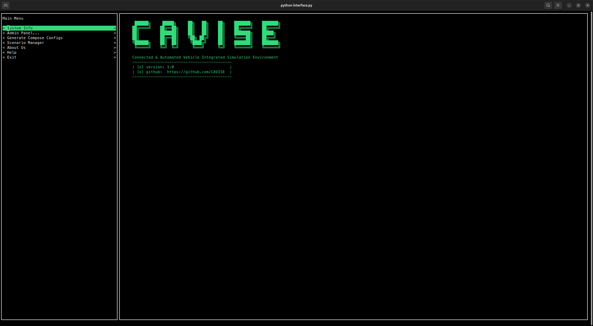

CAVISE Simulator (Project 982)
=============================

Overview
--------

This repository contains the tools used in the development
of the DRL-FL team, as well as our own developments - **CAPI** and others.

History
-------

**OpenCDA** and **Artery** are two separate tools that can work
and were developed separately, however, in 2023 & 2024, the DRL&FL team implemented
a protocol for the interaction of these tools within the framework of the basic scenario *realistic_town06_cosim*
and it is called CAPI.

Both simulators use their modules to interact together, in **Artery** there is a class
**CommunicationManager** (part of the comms static library), which provides network
interaction with artery in a separate thread, synchronizes requests from several cavs and collects
data from them.

In OpenCDA, **CommunicationManager** is part of CavWorld and essentially just one of the components
responsible for interacting with **Artery**. Methods of serialization and deserialization of data,
that was sent to **Artery** and received from it are also implemented.

Compiling protobuf to source code files is part of the **Artery** compilation routine.

Full Use of the Simulator
-------------------------

Installation
~~~~~~~~~~~~

Clone the Repository
~~~~~~~~~~~~~~~~~~~~

To clone the main repository (recommended):

.. code:: bash

   git clone ssh://git@172.18.130.50:8822/cavise-982/highly_accurate-cda-ise.git

Alternatively, using HTTPS:

.. code:: bash

   git clone https://172.18.130.50:9443/cavise-982/highly_accurate-cda-ise.git

Install Dependencies
~~~~~~~~~~~~~~~~~~~~

Ensure you have Python 3.10 or higher installed:

.. code:: bash

   python3 -m venv venv
   source venv/bin/activate
   pip3 install -r requirements.txt

Install Required Repositories
~~~~~~~~~~~~~~~~~~~~~~~~~~~~~

.. code:: bash

   cd highly_accurate-cda-ise
   ./setup.py

To install specific repositories:

.. code:: bash

   ./setup.py opencda

Build and Run the Simulator
~~~~~~~~~~~~~~~~~~~~~~~~~~~

Using Docker Compose
~~~~~~~~~~~~~~~~~~~~ 

Run all components:

.. code:: bash

   docker compose -f dc-configs/docker-compose.yml --env-file paths.conf build # Build
   docker compose -f dc-configs/docker-compose.yml --env-file paths.conf up -d # Start

To run specific services:

.. code:: bash

   docker compose -f dc-configs/docker-compose.yml --env-file paths.conf up -d <service-name>

Other Docker Compose commands:

.. code:: bash

   docker compose -f dc-configs/docker-compose.yml --env-file paths.conf restart <service-name>
   docker compose -f dc-configs/docker-compose.yml --env-file paths.conf down <service-name>

Using `run.sh`
~~~~~~~~~~~~~~

Alternatively, use the predefined script:

.. code:: bash

   ./run.sh up

Run specific services:

.. code:: bash

   ./run.sh build <service-name>
   ./run.sh up <service-name>
   ./run.sh restart <service-name>
   ./run.sh down <service-name>

Using `interface.py`
~~~~~~~~~~~~~~~~~~~~

Install dependencies and run the interface:

.. code:: bash

   pip install -r requirements.txt
   python interface.py

Go to **Admin Panel → Simulator Control Panel**, then click **Build**.

Running Individual Components
~~~~~~~~~~~~~~~~~~~~~~~~~~~~~

Carla
~~~~~

Enter the Carla container:

.. code:: bash

   docker exec -it carla bash

Start Carla:

.. code:: bash

   ./CarlaUE4.sh

Lower quality settings:

.. code:: bash

   ./CarlaUE4.sh --quality-level=Low

Run in headless mode:

.. code:: bash

   ./CarlaUE4.sh -RenderOffScreen

Change map or weather:

.. code:: bash

   ./PythonAPI/util/config.py --map Town06
   ./PythonAPI/util/config.py --weather ClearNoon

SUMO
~~~~

Enter the SUMO container:

.. code:: bash

   docker exec -it sumo bash

Start SUMO:

.. code:: bash

   sumo-gui -c /path/to/scenario.sumocfg --remote-port x --num-clients n

Example:

.. code:: bash

   sumo-gui -c assets/rsu_check/rsu_check.sumocfg --remote-port 3000 --num-clients 2

OpenCDA
~~~~~~~

Enter the OpenCDA container:

.. code:: bash

   docker exec -it opencda bash

Run a scenario:

.. code:: bash

   python opencda.py -t rsu_check

Run SUMO during simulation:

.. code:: bash

   python opencda.py -t rsu_check --cosim

Enable free camera movement:

.. code:: bash

   python opencda.py -t rsu_check --cosim --free-spectator

Run cooperative perception models:

.. code:: bash

   python opencda.py -t rsu_check --cosim --free-spectator \
   --with-coperception --model-dir opencda/coperception_models/point_pillar_where2comm_v2xset --fusion-method intermediate

For help:

.. code:: bash

   python opencda.py -h

Artery
~~~~~~

Enter the Artery container:

.. code:: bash

   docker exec -it artery bash
   cd build/Release/

Run a scenario in Artery:

.. code:: bash

   cmake --build . --target run_realistic_town06_cosim

Start SUMO (see SUMO section), then run the OpenCDA scenario:

.. code:: bash

   python opencda.py -t realistic_town06_cosim -c --with-capi

Troubleshooting
~~~~~~~~~~~~~~~

Carla Error: "Town06 is not found"
~~~~~~~~~~~~~~~~~~~~~~~~~~~~~~~~~~

Ensure the city has changed in Carla, then retry the scenario.

OpenCDA Error: "No module named ‘opencood.utils.box_overlaps’"
~~~~~~~~~~~~~~~~~~~~~~~~~~~~~~~~~~~~~~~~~~~~~~~~~~~~~~~~~~~~~~

.. code:: bash

   cd OpenCOOD
   python opencood/utils/setup.py build_ext --inplace

Display Errors in Artery
~~~~~~~~~~~~~~~~~~~~~~~~

.. code:: bash

   qt.qpa.xcb: could not connect to display :0

Run on host:

.. code:: bash

   xhost +local:docker

(Additionally) Artery development
---------------------------------

You may only need to collect **Artery** locally for syntax highlighting to work correctly.
To do this, run these commands:

.. code:: bash

   source configure.sh
   cd artery/
   source ./tools/setup/configure.sh
   ./tools/setup/build.py -b -c --config Debug --link

(Additionally) Interface info
-----------------------------

To run, you need:

.. code:: bash

   pip install -r requirements.txt
   python interface.py

After completing the previous step, you will be taken to the interface:

Menu content
~~~~~~~~~~~~

.. code::

   |_ Info
   |_ Admin Panel 
   |____ Simulator control panel
   |____ OpenCDA Info
   |____ Artery Info
   |____ Carla Info
   |____ Scenario Manager Info                                        
   |_ Generate Compose Configs
   |_ Scenario Manager
   |_ About Us
   |_ Help
   |_ Exit

System Info
~~~~~~~~~~~

Shows running simulations, docker/docker compose versions, hardware statuses

Admin Panel -> Simulator control panel
~~~~~~~~~~~~~~~~~~~~~~~~~~~~~~~~~~~~~~

Overview                 
- Select File: Choose a Docker Compose configuration file.
- Custom Parameters: Specify additional Docker Compose options (optional).
- Select Services: Specify which services to start, stop, or restart (optional).
- Build Button: Builds the Docker services.
- Up Button: Starts the Docker services.
- Down Button: Stops and removes the Docker containers.
- Restart Button: Restarts the Docker services.

Usage
~~~~~

1. Select File (File Selector)
   - Purpose: Choose a Docker Compose configuration file.
   - Where to Write: In this field, enter the name of the configuration file you want to use. If no file is selected, the form will automatically use the first file in the list.
2. Custom Parameters (Custom Params Input)
   - Purpose: Specify any additional parameters that will be passed to Docker Compose commands.
   - Where to Write: Enter custom flags or options for the Docker Compose command. These can include options like --build, --pull, --quiet, etc.
     You can view the full list of parameters by following here: https://gabrieldemarmiesse.github.io/python-on-whales/
3. Select Services (Services Input)
   - Purpose: Specify which services from your Docker Compose file should be affected by the command.
   - Where to Write: Enter the name of the services you want to start, stop, or restart. By default, the form will try to use the "main sim" service.

Buttons for Docker Compose Actions
~~~~~~~~~~~~~~~~~~~~~~~~~~~~~~~~~~

These buttons are the primary actions you will use in this form. Each button will execute a corresponding Docker Compose command with the parameters you specify.

1. Build (Build Button)
   - Purpose: This button will run the docker compose build command to build your Docker services based on the selected file and parameters.
2. Up (Up Button)
   - Purpose: This button will run the docker compose up command, which starts the Docker services.
3. Down (Down Button)
   - Purpose: This button will run the docker compose down command to stop the services and remove the associated containers.                       
4. Restart (Restart Button)
   - Purpose: This button will run the docker compose restart command to restart services without shutting down the entire environment.                      

Output Area (Script Output)
~~~~~~~~~~~~~~~~~~~~~~~~~~~~

- Purpose: Displays the logs and status of the actions you perform.
- What to Expect: After clicking any button (e.g., Build, Up, Down, Restart), the output will appear here. It shows real-time logs, errors, or success messages from Docker Compose.

Admin Panel -> ComponentName Info
~~~~~~~~~~~~~~~~~~~~~~~~~~~~~~~~~

Shows hardware resources used by the container and his logs in real-time mode

(Additionally) Generate Compose Configs
---------------------------------------

CAVISE docker-compose generator. This tool is used to dynamically

Create docker-compose configs depending on one's needs. Originally,
the needs were:
- use local builds or pull containers from remotes
- optional artery mount
these might be extended further.

Help
~~~~

.. code::

   --help                  prints this message.
   --version               prints script version.
   -v, --verbosity         set logger verbosity, numbers are related to python
                           logging levels, for ex. 10 - Debug, 20 - INFO.
   -e, --env-file FILE     name or absolute path to .env file that is used in preprocessing.
   -t, --template FILE     name or absolute path to template file.
   --handlers HANDLERS...  list of handlers to use. Overrides --pack, if also supplied.
   --pack PACK             pre-defined list of handlers to use.
   --output-name NAME      name of output file, defaults to compose.yml
   --output-path PATH      path, where output file is stored. Defaults to simdata.
   --template-path PATH    path, where template files are looked up.
   --environment-path PATH path, where .env files are looked up.

(Additionally) Scenario Manager
-------------------------------

This panel is designed for sending API requests and displaying the responses. It consists of several key components:

1. Input Fields
   - API URL: Enter the URL for the request. This field supports multi-line input.
   - Headers: Enter the headers for your API request in JSON format (e.g., {"Content-Type": "application/json"}). This field supports multi-line input.
   - Data: Enter the request body data in JSON format (e.g., {"key": "value"}). This field supports multi-line input.

2. Send Button
   - Send!: After filling in all the fields, click this button to send a POST request with the entered data.

3. Response Output
   - Response: After sending the request, the result will be displayed in this field as a formatted JSON response from the server.

