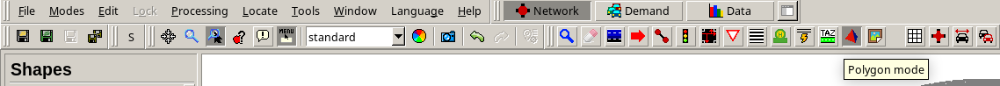
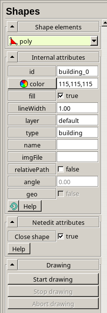
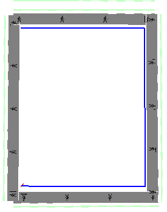
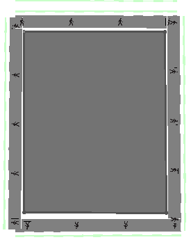

Scenario Creation
=================

YAML File
---------

The YAML file contains scenario settings from the Carla side, i.e., information and settings for vehicles and RSUs generated by it.

In the `opencda/opencda/scenario_testing/config_yaml` directory, create a `<scenario_name>.yaml` file. These files are usually standard and can be copied and modified from an existing one. For more details on YAML configuration, refer to: https://opencda-documentation.readthedocs.io/en/latest/md_files/yaml_define.html

To connect SUMO to a scenario, you must add the following block to the YAML file and provide the relevant SUMO configuration files:

.. code-block:: yaml

    sumo:
        port: 3000
        host: sumo
        gui: true
        client_order: 2
        step_length: ${world.fixed_delta_seconds}

Example:  
https://172.18.130.50:9443/cavise-982/opencda/-/blob/main/opencda/scenario_testing/config_yaml/rsu_check.yaml?ref_type=heads

Assets
------

All SUMO-related files are stored in the `sumo/assets/` directory. Create a subdirectory named `<scenario_name>` and add the following files:

<scenario_name>.sumocfg
"""""""""""""""""""""""
The main SUMO config file, which references the other configuration files such as `.rou.xml`, `.net.xml`, etc.

Example:  
https://172.18.130.50:9443/cavise-982/opencda/-/blob/main/opencda/assets/rsu_check/rsu_check.sumocfg?ref_type=heads

<scenario_name>.rou.xml
"""""""""""""""""""""""
This file defines vehicle routes. Use `flow` to define traffic flow and `trip` to define the path of a single vehicle. More information: https://sumo.dlr.de/docs/Definition_of_Vehicles%2C_Vehicle_Types%2C_and_Routes.html  
You can also use a Python script to generate random trips: https://sumo.dlr.de/docs/Tools/Trip.html  
The `from` and `to` fields are road segment IDs, which can be obtained by opening the `.net.xml` file in SUMO and right-clicking on a segment.

**Important:**  
If the scenario uses SUMO, there must always be at least one vehicle or flow active; otherwise, the simulation ends immediately.  
To prevent early termination, you can add a dummy stationary vehicle like this (replace `edges` and `lane` with actual values):

.. code-block:: xml

    <vehicle id="stopped_car" type="vType_0" depart="0">
        <route edges="27 26"/>
        <stop lane="27_3" startPos="0" endPos="5" duration="100000"/>
    </vehicle>

Example:  
https://172.18.130.50:9443/cavise-982/opencda/-/blob/main/opencda/assets/rsu_check/rsu_check.rou.xml?ref_type=heads

<scenario_name>.net.xml
"""""""""""""""""""""""
This file describes the road network in SUMO format. It must be generated for each map.  
If the map already exists in another scenario, you can copy it. Otherwise, generate it as described in the section below.

Example:  
https://172.18.130.50:9443/cavise-982/opencda/-/blob/main/opencda/assets/rsu_check/rsu_check.net.xml?ref_type=heads

CAPI Support Files
""""""""""""""""""

If the scenario uses Artery, you need to create one required and one optional file:

<scenario_name>_artery.sumocfg
""""""""""""""""""""""""""""""
Similar to the standard `.sumocfg` but with `num-clients = 2`.

Example:  
https://172.18.130.50:9443/cavise-982/opencda/-/blob/main/opencda/assets/rsu_check/rsu_check_artery.sumocfg?ref_type=heads

<scenario_name>.poly.xml
""""""""""""""""""""""""
Optional file. It describes various zones like buildings or trees that might affect signal propagation.  
Used by Artery for accurate communication modeling. For Town06, use the existing example; otherwise, create manually using netedit.

Example:  
https://172.18.130.50:9443/cavise-982/opencda/-/blob/main/opencda/assets/rsu_check/rsu_check.poly.xml?ref_type=heads

Artery
------

Artery configuration is stored in the `artery/scenarios/` directory. Create a subfolder named `<scenario_name>`.  
Example:  
https://172.18.130.50:9443/cavise-982/artery/-/tree/main/scenarios/rsu_check?ref_type=heads

Files in this folder are the same as for SUMO:  
<scenario_name>.net.xml, <scenario_name>.poly.xml, <scenario_name>.rou.xml, <scenario_name>.sumocfg (Artery version)

You also need the following additional files:

omnetpp.ini
"""""""""""
Standard config file. Change only the line `*.traci.launcher.sumocfg = "<sumoconfig_name>.sumocfg"`:

.. code-block:: ini

    [General]
    network = artery.inet.World
    scheduler-class = artery::AsioScheduler

    **.scalar-recording = false
    **.vector-recording = false

    *.traci.core.version = -1
    *.traci.launcher.typename = "PosixLauncher"
    *.traci.launcher.sumocfg = "<sumoconfig_name>.sumocfg"
    *.traci.launcher.sumo = "sumo-gui"
    *.traci.launcher.port = 8813

    *.node[*].wlan[*].typename = "VanetNic"
    *.node[*].wlan[*].radio.channelNumber = 180
    *.node[*].wlan[*].radio.carrierFrequency = 5.9 GHz
    *.node[*].wlan[*].radio.transmitter.power = 200 mW

    *.node[*].middleware.updateInterval = 0.1s
    *.node[*].middleware.datetime = "2013-06-01 12:35:00"

    *.node[*].middleware.services = xmldoc("services.xml")

    [Config separated-sumo]
    *.traci.launcher.typename = "ConnectLauncher"
    *.traci.launcher.hostname = "sumo"
    *.traci.launcher.port = 3000
    *.traci.launcher.clientId = 1

services.xml
""""""""""""""""""""""""""""""""""
Standard for all scenarios. Copy from `rsu_check`.

artery/scenarios/CMakeLists.txt
""""""""""""""""""""""""""""""""""
To enable scenario execution, add it to `CMakeLists.txt`. Just change the scenario name:

.. code-block:: cmake

    add_opp_run(<scenario_name> WORKING_DIRECTORY ${CMAKE_CURRENT_SOURCE_DIR}/<scenario_name> NED_FOLDERS ${CMAKE_SOURCE_DIR}/src/cavise)

How to Get Coordinates for YAML Files
-------------------------------------

After launching Carla using `cd /carla && ./CarlaUE4.sh &disown`, change the map to the desired one:

.. code-block:: bash

    /home/carla/PythonAPI/util/config.py --map Town06

OpenCDA provides two scripts: `get_position.py` and `set_position.py`, located in `opencda/opencda/scenario_testing/utils`.  
Keep the z-coordinate as `1.05`. Leave the 4th and 6th parameters as `0`.

get_position.py
""""""""""""""""""""""""""""""""""
Outputs the current spectator position. Change port to match Carla’s configuration.

.. code-block:: python

    import carla  
    import random  
    
    client = carla.Client('carla', 2000)  
    world = client.get_world()  
    
    spectator = world.get_spectator()
    location = spectator.get_transform().location
    rotation = spectator.get_transform().rotation
    print(f'Location: {location.x:.2f}, {location.y:.2f}, {location.z:.2f},')
    print(f'Rotation: {rotation.pitch:.2f}, {rotation.yaw:.2f}, {rotation.roll:.2f}')

set_position.py
""""""""""""""""""""""""""""""""""
Used to place the spectator at a specified coordinate:

.. code-block:: python

    import carla  
    import random  
    
    client = carla.Client('carla', 2000)  
    world = client.get_world()  
    
    spectator = world.get_spectator()  
    
    x, y, z = map(float, input().split(","))  
    location = carla.Location(x=x, y=y, z=z)  
    rotation = carla.Rotation(pitch=0, yaw=-180, roll=0)  
    spectator.set_transform(carla.Transform(location, rotation))

.. _gen-net-xml:

Generating .net.xml for Carla Maps
----------------------------------

**Problem**: Only Town06 has fully working `.net.xml` in the current project.

**Solution**: Carla provides a script to generate `.net.xml` from `.xodr` maps (official guide: https://carla.readthedocs.io/en/latest/adv_sumo/#create-the-sumo-net)

In the Carla container, `.xodr` map files are located in:  
`CarlaUE4/Content/Carla/Maps/OpenDrive/`

Install dependencies and define the `SUMO_HOME` environment variable:

.. code-block:: bash

    carla@ed06e934540b:~$ pip install eclipse-sumo lxml
    carla@ed06e934540b:~$ pip show eclipse-sumo
    Name: eclipse-sumo
    Version: 1.22.0
    Summary: A microscopic, multi-modal traffic simulation package
    Home-page: https://sumo.dlr.de/
    Author: DLR and contributors
    Author-email: sumo@dlr.de
    License: EPL-2.0
    Location: /home/carla/.pyenv/versions/3.10.11/lib/python3.10/site-packages
    Requires: 
    Required-by: 
    carla@ed06e934540b:~$ export SUMO_HOME=/home/carla/.pyenv/versions/3.10.11/lib/python3.10/site-packages/sumo/

Then run the script at:  
`Co-Simulation/Sumo/util/netconvert_carla.py`

.. code-block:: bash

    python Co-Simulation/Sumo/util/netconvert_carla.py CarlaUE4/Content/Carla/Maps/OpenDrive/Town04.xodr --output mounted/Town04_1.net.xml

.. _gen-poly-xml:

Creating .poly.xml
------------------

Start by creating a template file and referencing it in the `.sumoconfig` using the line `<additional-files value="scenario_name.poly.xml"/>`:  

.. code-block:: xml

    <additional xmlns:xsi="http://www.w3.org/2001/XMLSchema-instance" xsi:noNamespaceSchemaLocation="http://sumo.dlr.de/xsd/additional_file.xsd">
    </additional>

Then, open the scenario in `netedit` (Ctrl+M or File → Load sumo config) and switch to Polygon Mode.

In the settings, enable `fill` and `Close shape`, and optionally set ID, color, and type.

Click Enter to start drawing the polygon. Mark the desired area on the map and press Enter again to stop.  
Repeat for all necessary zones and save the file.

